# Bài tập lớn số 1 — Những lỗi trong thiết kế website (Tính tiện dùng)

> **Môn học:** Tương tác Người – Máy
> **Nguồn lý thuyết chính:** *Bài 3 – Phần 2 — Tính tiện dùng* (GV. Nguyễn Thị Thu Hương — Khoa CNTT, Bộ môn CNPM, ĐH Thủy Lợi)
> **Tham chiếu gốc:** Galitz tổng kết 12 lỗi thiết kế website thường gây lãng phí thời gian và ức chế người sử dụng.

---

## 1. Mở đầu

Trong bài giảng môn Tương tác Người – Máy, cô có nhắc đến định nghĩa của **ISO 9241-11**: tính tiện dùng (*usability*) là *"phạm vi trong đó sản phẩm được sử dụng bởi nhóm người xác định để đạt được những mục tiêu xác định với tính hiệu quả, tính hiệu suất và sự hài lòng trong ngữ cảnh sử dụng xác định"*. Đọc định nghĩa này em thấy nó khá trừu tượng, nhưng khi thử ngồi đối chiếu với những website mà bản thân từng "vật lộn" để dùng, em mới nhận ra ba yếu tố đó rõ nét đến mức nào.

Một website tiện dùng kém sẽ trực tiếp:

- **Giảm tính hiệu quả** — người dùng không hoàn thành được nhiệm vụ, hoặc hoàn thành sai.
- **Giảm tính hiệu suất** — phải tốn nhiều thời gian, thao tác và công sức hơn mức cần thiết.
- **Giảm sự hài lòng** — người dùng bực bội, lo lắng, mất niềm tin và rời site.

Trong báo cáo này, em phân tích **12 lỗi thiết kế website tiêu biểu** mà Galitz đã tổng kết và được cô trình bày trong slide bài giảng. Với mỗi lỗi, em sẽ: (i) trích định nghĩa từ tài liệu môn học, (ii) đưa ra một website thực tế làm minh họa, (iii) phân tích tác động đến ba đặc tính của tính tiện dùng theo ISO 9241-11, đồng thời liên hệ với **6 nguyên lý thiết kế của Don Norman** (rõ ràng, phản hồi, ràng buộc, ánh xạ, nhất quán, gợi ý) và **10 heuristic của Jakob Nielsen**, và (iv) đề xuất hướng khắc phục.

## 2. Cách em chọn ví dụ

Để tránh đưa ra ví dụ "nghe có vẻ đúng" nhưng không thật, em chọn các website **có thật** đang hoặc đã tồn tại trên Internet, và là những trường hợp được cộng đồng UX (Nielsen Norman Group, Smashing Magazine, Webdesignerdepot…) thường xuyên trích dẫn như ví dụ điển hình vi phạm các nguyên tắc tính tiện dùng.

Ảnh chụp được lấy bằng công cụ tự động hóa trình duyệt `agent-browser` (Chromium 148) trên Windows. Một số site bị chặn truy cập trực tiếp (timeout, Cloudflare) nên em chụp qua **Wayback Machine (web.archive.org)** — phiên bản lưu trữ vẫn giữ đúng thiết kế gốc cần minh họa. Toàn bộ ảnh được chụp ngày **27/04/2026** và lưu trong thư mục `./images/`.

---

## 3. Phân tích 12 lỗi

### Lỗi 1. Gây nhiễu thị giác

**Định nghĩa (theo tài liệu môn học):**
> *"Sự thiếu đi 'không gian trống', nhiều đồ họa vô nghĩa, cách trang trí không cần thiết và lãng phí → website bố trí các thành phần hỗn độn. Nội dung có ý nghĩa khó tìm → người sử dụng mất thời gian tìm. Các phần tử hiển thị vô dụng."*

*Nguồn: https://web.archive.org/web/2024/https://www.arngren.net/ — chụp 27/04/2026.*

Trang `arngren.net` là một ví dụ kinh điển trong giới UX: hàng trăm sản phẩm xếp chồng chéo, không có lưới, không phân nhóm, ảnh sản phẩm và chữ giá cả trộn lẫn vào nhau. Khi em vào trang này để thử tìm "xe đạp điện cho trẻ em", mắt em gần như không biết bắt đầu từ đâu — không có yếu tố nào "nổi" lên dẫn dắt.

- **Tính hiệu quả:** Vì không có hierarchy thị giác, người dùng dễ bỏ sót đúng món mình cần, hoặc click nhầm sản phẩm khác.
- **Tính hiệu suất:** Trang vi phạm heuristic *"Aesthetic and minimalist design"* (Nielsen #10). Mọi pixel đều cạnh tranh sự chú ý, nên thời gian định vị một sản phẩm dài hơn hẳn so với một trang thương mại điện tử bình thường.
- **Sự hài lòng:** Theo em, cảm giác đầu tiên khi load trang là choáng. Đây chính xác là kiểu giao diện làm người dùng đóng tab trong vài giây đầu.
- **Liên hệ Norman:** Vi phạm nguyên lý *Sự rõ ràng (Visibility)* — không có gì hướng dẫn ánh nhìn.

**Khắc phục:** áp dụng nguyên tắc khoảng trắng (white space), phân nhóm sản phẩm theo danh mục có header rõ, giới hạn số sản phẩm hiển thị trên một trang và thêm phân trang, sử dụng kích thước/độ tương phản/khoảng cách để dựng hierarchy.

---

### Lỗi 2. Làm giảm khả năng đọc thông tin

**Định nghĩa:**
> *"Việc sử dụng quá nhiều các loại kiểu chữ, màu sắc biến ảo thất thường làm màn hình như cuộc chiến hỗn độn → giảm tập trung, giảm khả năng đọc. Các nền có màu sắc sáng hay có những bức tranh hoặc các mẫu hoa văn sẽ làm giảm đi tính dễ đọc của các dòng chữ phía trên."*

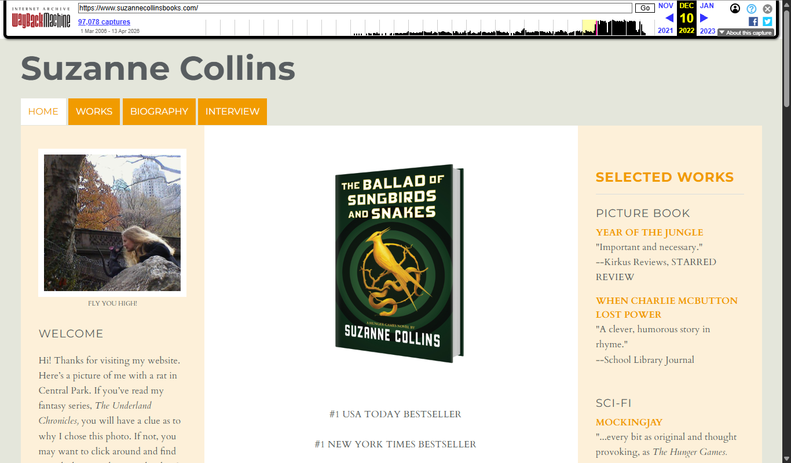

*Nguồn: https://web.archive.org/web/2022/https://www.suzannecollinsbooks.com/ — chụp 27/04/2026.*

Trang giới thiệu sách của Suzanne Collins (tác giả *Hunger Games*) bản cũ dùng nền hoa văn rậm rạp ngay phía sau khối text dài, đồng thời trộn nhiều cỡ chữ và màu chữ (đen, xanh, vàng) trên cùng viewport.

- **Tính hiệu quả:** Người đọc phải bóc tách "tiền cảnh chữ" ra khỏi "hậu cảnh hình", tốc độ đọc chậm đi rõ rệt.
- **Tính hiệu suất:** Tỷ lệ tương phản giữa chữ và nền không đạt mức tối thiểu của WCAG 2.1 (4.5:1 cho text thường), nên việc đọc lướt — vốn là cách người dùng web hay làm — gần như không khả thi.
- **Sự hài lòng:** Trang gần như loại trừ hẳn người lớn tuổi và người có vấn đề thị lực. Bản thân em đọc một lúc cũng thấy mỏi mắt.
- **Liên hệ Norman:** Vi phạm *Sự rõ ràng* — thông tin chính (chữ) không nổi bật so với nhiễu nền.

**Khắc phục:** dùng nền đơn sắc, tương phản cao; giới hạn không quá 2 font và 3 cỡ chữ trên một trang; kiểm tra contrast bằng các công cụ như WebAIM Contrast Checker.

---

### Lỗi 3. Nhiều chi tiết khó hiểu

**Định nghĩa:**
> *"Một số chi tiết thiết kế không liên quan tới chức năng, người sử dụng, xa rời mục đích sử dụng và không rõ ràng. Các nút hay các vùng lệnh mà không biểu thị trực quan → người sử dụng khó phát hiện. Ngôn ngữ thường xuyên bị lẫn lộn với các thuật ngữ của người phát triển chứ không phải dành cho người sử dụng."*

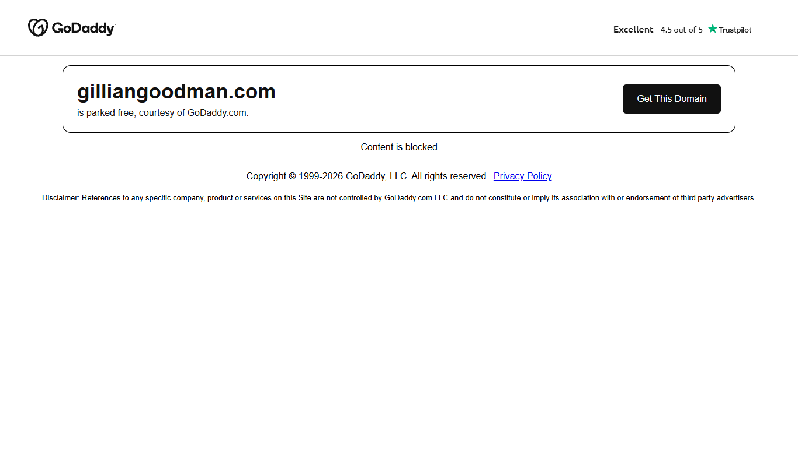

*Nguồn: https://www.gilliangoodman.com/lander — chụp 27/04/2026.*

Đây là một landing page với nhiều chi tiết đồ họa (đèn pha, các chấm chuyển động) nhưng không hề gợi ý chức năng nào rõ ràng. Em phải rê chuột khắp trang mới biết đâu là vùng có thể click — và đó chính là điều một website tốt không nên bắt người dùng làm.

- **Tính hiệu quả:** Vi phạm thẳng nguyên lý *gợi ý (affordance)* của Norman — không có tín hiệu trực quan nào báo "đây là vùng tương tác".
- **Tính hiệu suất:** Vi phạm heuristic *"Recognition rather than recall"* (Nielsen #6). Người dùng buộc phải đoán mò.
- **Sự hài lòng:** Thử – sai liên tục là một trong những trải nghiệm khó chịu nhất trên web, đặc biệt với người dùng vào trang vì mục đích cụ thể chứ không phải để khám phá.

**Khắc phục:** mọi phần tử tương tác phải có affordance rõ (nút có viền/đổ bóng, link gạch chân, hover state); dùng ngôn ngữ tự nhiên cho người dùng cuối thay vì thuật ngữ kỹ thuật; thêm tooltip hoặc microcopy cho thao tác không trực quan.

---

### Lỗi 4. Nhiều trò gây bực mình

**Định nghĩa:**
> *"Các chi tiết chuyển động không ngừng, các dòng chữ chạy cuộn lên xuống, nhấp nháy, hình ảnh hoạt hình chạy lòng vòng sẽ ganh đua với các nội dung có ý nghĩa. Nhạc nền hay bất kỳ âm thanh tự động bật lên sẽ làm gián đoạn sự tập trung; các pop-up windows làm mất nhiều thời gian. → Khi giác quan người sử dụng bị tác động quá nhiều, tầm nhìn của họ bị giới hạn đi nhiều."*

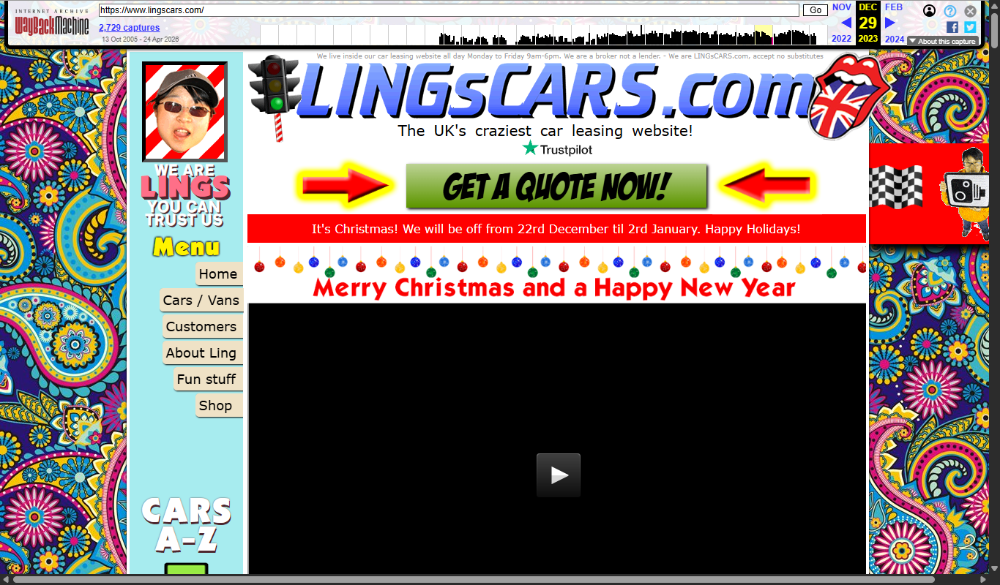

*Nguồn: https://web.archive.org/web/2023/https://www.lingscars.com/ — chụp 27/04/2026.*

`lingscars.com` (do Ling Valentine vận hành) gần như là "bảo tàng anti-pattern": GIF nhấp nháy khắp trang, nhạc nền tự bật, pop-up trò chuyện, biểu cảm khuôn mặt động, cờ vẫy… tất cả cùng hiện. Điều thú vị là chủ trang chủ ý làm như vậy để "khác biệt", và doanh nghiệp này vẫn sống tốt — nhưng đứng ở góc độ tính tiện dùng thì đây là ví dụ rất rõ.

- **Tính hiệu quả:** Mục tiêu chính (so sánh và thuê xe) bị che khuất bởi hàng chục yếu tố vui mắt khác.
- **Tính hiệu suất:** Vô số animation chạy đồng thời làm não phải liên tục lọc thông tin nào đáng chú ý, dẫn đến quá tải nhận thức (cognitive overload). Em mở trang trong vài phút là đã thấy mệt.
- **Sự hài lòng:** Một bộ phận người dùng thấy thú vị, nhưng phần lớn (đặc biệt người lần đầu vào) sẽ bỏ chạy. Trang còn vi phạm WCAG 2.2.2 (Pause, Stop, Hide) — người dùng không có cách nào tắt chuyển động.
- **Heuristic vi phạm:** *Aesthetic and minimalist design* và *User control and freedom* (Nielsen #10, #3).

**Khắc phục:** không auto-play chuyển động/âm thanh; nếu có animation thì phải cho phép dừng; pop-up chỉ xuất hiện sau tương tác chủ động; tôn trọng `prefers-reduced-motion`.

---

### Lỗi 5. Sự điều hướng lẫn lộn

**Định nghĩa:**
> *"Cấu trúc của một trang Web thường giống với một mê cung gồm rất nhiều trang đan xoắn vào nhau → làm người sử dụng lạc vào trong đó. Nghèo nàn, tủn mủn và thiếu sự tổ chức… có thể dẫn đến 'mất cảm giác không gian'. Các đường liên kết điều hướng sẽ dẫn đến các 'ngõ cụt'… Sự điều hướng lẫn lộn làm hỏng những kỳ vọng của người sử dụng."*

*Nguồn: https://web.archive.org/web/2024/https://www.arngren.net/ — chụp 27/04/2026.*

Quay lại `arngren.net` vì trang này không chỉ nhiễu thị giác mà còn là một mê cung điều hướng. Không có breadcrumb, không có thanh nav cố định, danh mục bị nhúng lẫn trong nội dung. Click vào một sản phẩm xong em thật sự không biết quay về danh mục cha bằng cách nào ngoài nhấn nút Back của trình duyệt.

- **Tính hiệu quả:** Vi phạm *"Visibility of system status"* (Nielsen #1) — không có chỉ báo "tôi đang ở đâu trong cấu trúc trang".
- **Tính hiệu suất:** Người dùng phải dùng nút Back liên tục, luồng làm việc rời rạc.
- **Liên hệ Norman:** Vi phạm *Ánh xạ (Mapping)* — quan hệ giữa cấu trúc thông tin và cấu trúc điều hướng không tự nhiên.

**Khắc phục:** thanh điều hướng chính cố định, hiển thị mọi danh mục cấp 1; breadcrumb; highlight mục đang xem; có sitemap hoặc thanh tìm kiếm tốt.

---

### Lỗi 6. Điều hướng không hiệu quả

**Định nghĩa:**
> *"Người sử dụng phải đi ngang qua những trang có nội dung vô nghĩa để tìm trang có nội dung cần thiết. Toàn bộ màn hình được dùng để trỏ tới trang khác. → Đó là sự lãng phí lớn không gian đồ họa và chỉ làm gia tăng số trang một cách không cần thiết. Đường dẫn qua mê cung điều hướng đó thường dài và chán ngắt."*

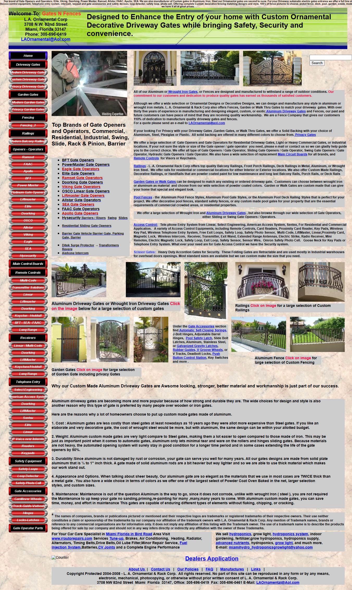

*Nguồn: https://www.gatesnfences.com/ — chụp 27/04/2026.*

Trang `gatesnfences.com` có thanh menu trái với rất nhiều mục mà tên gần như trùng nhau: `Driveway Gates`, `Modern Driveway Gates`, `Custom Driveway Gates`, `Privacy Driveway Gates`… Khi click thử, em thấy nhiều trang trung gian gần như giống hệt, chỉ đổi vài câu chữ, trước khi đến được sản phẩm cụ thể.

- **Tính hiệu quả:** Người dùng dễ chọn sai nhánh chỉ vì tên gọi quá giống nhau.
- **Tính hiệu suất:** Vi phạm tinh thần *3-click rule* — nội dung quan trọng nên nằm trong khoảng 3 cú click. Ở đây thường phải 4–5 cú mới tới đích.
- **Sự hài lòng:** Cảm giác "đi vòng vo" làm người dùng nghi ngờ liệu site có thật sự chứa thông tin mình cần. Theo em, đây là kiểu lỗi tệ vì nó vừa tốn thời gian vừa làm mất niềm tin.

**Khắc phục:** hợp nhất các trang trùng lặp; dùng dropdown / mega-menu thay vì các trang trung gian rỗng; thêm thanh tìm kiếm có gợi ý; áp dụng faceted navigation cho catalog sản phẩm.

---

### Lỗi 7. Tổ chức hoạt động không hiệu quả

**Định nghĩa:**
> *"Thời gian bị lãng phí vào làm những việc vô ích: thời gian tải một trang về có thể kéo quá dài… Thông tin bị phân mảnh quá mức: có thể đòi hỏi điều hướng đến một chuỗi dài các đường liên kết để tới được nội dung cần thiết."*

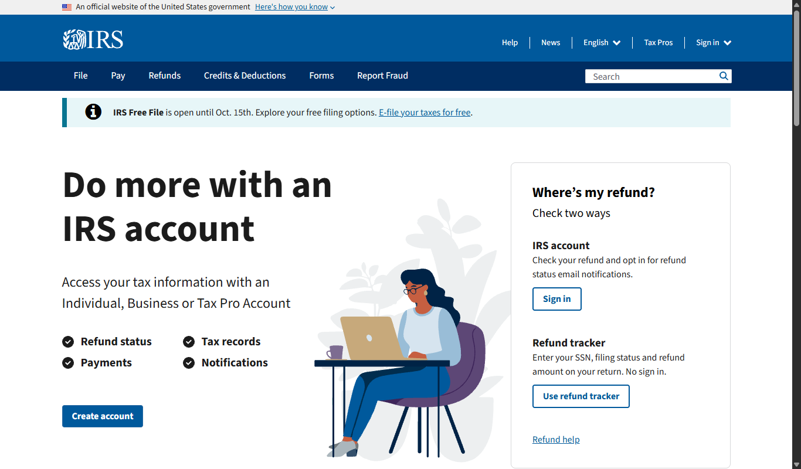

*Nguồn: https://www.irs.gov/ — chụp 27/04/2026.*

Trang `irs.gov` (Sở Thuế Hoa Kỳ) bị Nielsen Norman Group nhiều năm liền chỉ trích vì cách tổ chức thông tin: một quy trình thuế bị xé lẻ qua nhiều trang, mỗi trang chứa một phần và lại link sang trang khác. Em vào thử đọc về một mục thuế đơn giản, kết cục là mở 7–8 tab cùng lúc mà vẫn chưa thấy đủ.

- **Tính hiệu quả:** Người dùng cần điền form nhưng không tìm thấy đầy đủ hướng dẫn ở một chỗ → khả năng điền sai cao.
- **Tính hiệu suất:** Một tác vụ vốn chỉ cần một bài viết hướng dẫn lại buộc phải đi qua nhiều trang. Trang chủ cũng nặng (nhiều iframe, banner), với người ở vùng băng thông thấp thì việc tải trang đã là rào cản.
- **Sự hài lòng:** Vi phạm rõ heuristic *"Help and documentation"* (Nielsen #10) — tài liệu phân mảnh, người dùng tự ghép.

**Khắc phục:** tổ chức thông tin theo nhiệm vụ người dùng (task-based) thay vì theo cơ cấu nội bộ tổ chức; trang chủ nên là "task launcher" gom các hành động phổ biến; tối ưu hiệu năng (lazy-load, nén ảnh, CDN).

---

### Lỗi 8. Thanh cuộn quá dài và không hiệu quả

**Định nghĩa:**
> *"Những trang dài quá đòi hỏi phải có thanh cuộn. Người sử dụng có thể mất đi ngữ cảnh nội dung. Ngoài tầm nhìn thì sẽ ở ngoài tâm trí. Nếu các nhân tố định vị và nội dung quan trọng bị ẩn đi ở phía dưới, chúng có thể hoàn toàn bị bỏ qua. Phải cuộn thanh cuộn xuống để thực hiện và hoàn thành các tác vụ có thể gây khó chịu cho người sử dụng…"*

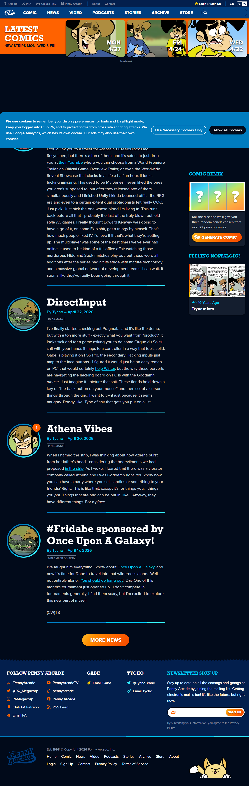

*Nguồn: https://www.penny-arcade.com/ — chụp 27/04/2026 (full-page screenshot).*

Trang chủ `penny-arcade.com` rất dài, gồm hàng chục module xếp chồng (tin tức, comic, podcast, sự kiện, sản phẩm, mạng xã hội), nhưng lại không có mục lục (TOC) hay nút "back to top". Khi em cuộn xuống cuối rồi muốn quay lên menu chính, gần như phải kéo chuột mỏi tay.

- **Tính hiệu quả:** Module quan trọng (latest comic) lại nằm dưới vài màn cuộn, dễ bị bỏ qua.
- **Tính hiệu suất:** Không có sticky nav nên muốn đổi mục, người dùng phải cuộn lên trên cùng — thao tác lặp đi lặp lại rất tốn công.
- **Sự hài lòng:** Trên mobile, scroll dài khiến mỏi mắt và mỏi ngón tay; người dùng dễ mất phương hướng.
- **Liên hệ Norman:** Vi phạm *Sự rõ ràng* — không có chỉ báo "tôi đang ở vị trí nào trong trang".

**Khắc phục:** sticky header khi cuộn; nút "Back to top" hiện sau khi cuộn 1 màn; phân trang hoặc lazy-load cho danh sách dài; trên mobile, ưu tiên thiết kế "above-the-fold" tập trung 1–2 hành động chính.

---

### Lỗi 9. Quá tải thông tin

**Định nghĩa:**
> *"Thông tin được tổ chức kém hoặc khối lượng thông tin quá lớn sẽ bắt người sử dụng phải nhớ nhiều và có thể vượt quá khả năng nhớ. Trí óc bị quá tải do: phải quyết định chọn hay bỏ liên kết nào trong khi có quá nhiều lựa chọn; xác định thông tin nào quan trọng và thông tin nào không; xác nhận vị trí thông tin trong một rừng thông tin dày đặc; người sử dụng phải học để có thể sử dụng được trang Web."*

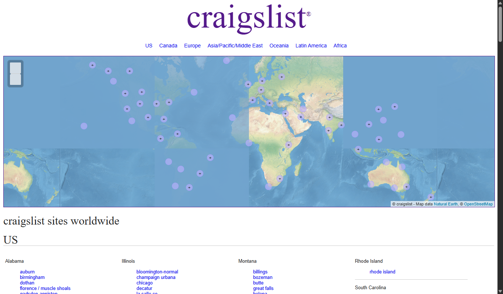

*Nguồn: https://www.craigslist.org/about/sites — chụp 27/04/2026.*

Trang liệt kê chi nhánh Craigslist toàn cầu hiển thị **hàng nghìn link** dạng text, font nhỏ và đều nhau, không có grouping nâng cao và không có bộ lọc. Em thử tìm "Hà Nội" — phải scan toàn bộ phần "Asia / Pacific" và rất dễ bỏ sót.

- **Tính hiệu quả:** Để tìm đúng thành phố, người dùng phụ thuộc hoàn toàn vào tổ hợp Ctrl+F.
- **Tính hiệu suất:** Theo *Miller's Law*, trí nhớ làm việc của người dùng chỉ giữ được 7±2 mục cùng lúc, nhưng trang này yêu cầu xử lý hàng nghìn mục cùng một viewport.
- **Sự hài lòng:** Vi phạm nguyên tắc **chunking** mà cô có giảng (chia thông tin thành nhóm dễ xử lý).

**Khắc phục:** chia thông tin theo nhóm có heading rõ (continent → country → city); thêm thanh tìm kiếm fuzzy; áp dụng *progressive disclosure* (chỉ hiện tóm tắt, click để xem chi tiết); nhớ *Hick's Law* — thời gian quyết định tăng theo log số lựa chọn, nên cần giảm số lựa chọn ngang cấp.

---

### Lỗi 10. Sự không nhất quán trong thiết kế

**Định nghĩa:**
> *"Chủ nhân của Website luôn muốn có đặc tính nhận dạng riêng… Tuy nhiên, để bảo đảm lợi ích của người sử dụng, một vài tính nhất quán cần phải có để tạo sự gắn kết liền mạch giữa các Website. Ví dụ tính nhất quán phải có đối với vị trí của phần tử điều hướng trên một trang hay hình dạng của các nút điều hướng (được để nổi lên). GUI trong thiết kế cần phải được tuân thủ."*

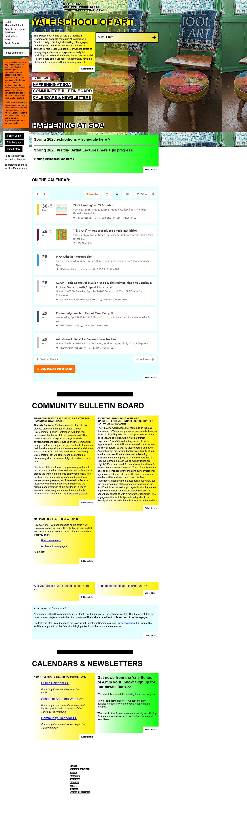

*Nguồn: https://www.art.yale.edu/ — chụp 27/04/2026.*

Website của Yale School of Art nổi tiếng vì là một wiki cho phép sinh viên và giảng viên tự sửa: mỗi mục có font, màu nền, kiểu chữ khác nhau; nút "Submit" chỗ này là button đỏ, chỗ khác lại là text link xanh; menu khi thì bên trái, khi thì bên trên. Đây được nhà trường xem như "thiết kế chủ ý" để phản ánh tinh thần nghệ thuật, nhưng nhìn từ góc độ tính tiện dùng thì khó chấp nhận.

- **Tính hiệu quả:** Vi phạm trực tiếp heuristic *"Consistency and standards"* (Nielsen #4). Cách dùng học được ở phần này không chuyển sang phần khác.
- **Tính hiệu suất:** Mỗi trang con buộc người dùng học lại — đường cong học tập bị reset liên tục.
- **Sự hài lòng:** Em thấy trang này thú vị về mặt nghệ thuật, nhưng nếu phụ huynh hoặc thí sinh vào tìm thông tin tuyển sinh thì có lẽ sẽ thấy thiếu chuyên nghiệp.
- **Liên hệ Norman:** Vi phạm *Nhất quán (Consistency)* ở cả mức nội tại (giữa các trang con) lẫn mức ngoại tại (so với chuẩn web phổ biến).

**Khắc phục:** xây design system với token chung (màu, font, spacing, shape); component library cho button/form/menu; style guide bắt buộc cho người đóng góp; tuân thủ convention của platform (Material Design, Apple HIG…).

---

### Lỗi 11. Thông tin quá cũ hoặc không đề ngày tháng

**Định nghĩa:**
> *"Một trong những giá trị quan trọng của Website là 'tính thời sự' của nó. Thông tin quá cũ hay không có ngày tháng cụ thể sẽ phá vỡ sự tin cậy dành cho Website trong tâm trí người sử dụng, cho nên tính thời sự là cần thiết."*

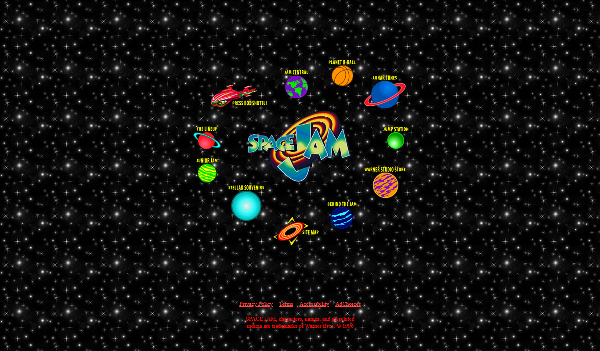

*Nguồn: https://www.spacejam.com/1996/ — chụp 27/04/2026.*

Warner Bros giữ nguyên trang Space Jam (1996) như một "di tích Internet" — không có dấu hiệu rõ ràng nào báo cho người dùng biết trang đã 30 năm tuổi (ngoại trừ chuỗi `/1996/` trong URL). Nếu một bạn nhỏ vào trang qua kết quả Google Search, rất có thể bạn ấy nhầm tưởng đây là thông tin cập nhật.

- **Tính hiệu quả:** Người dùng có thể dùng nhầm thông tin lỗi thời cho mục đích hiện tại.
- **Tính hiệu suất:** Thời gian xác minh lại thông tin còn đúng hay không là chi phí ngầm rất lớn.
- **Sự hài lòng:** Mất niềm tin (trust) là yếu tố nguy hiểm nhất trong UX — một khi mất, rất khó lấy lại.
- **Tham chiếu:** Đây là vi phạm nguyên lý "credibility" trong **Stanford Web Credibility Guidelines** (Fogg, 2002).

**Khắc phục:** mỗi bài/trang cần có timestamp "Đã đăng / Cập nhật lần cuối: dd-mm-yyyy"; trang lưu trữ nên có banner "Nội dung lưu trữ — không cập nhật từ năm X"; cập nhật định kỳ hoặc archive nội dung quá hạn.

---

### Lỗi 12. Thiết kế lỗi thời do mô phỏng tài liệu in và hệ thống cũ

**Định nghĩa:**
> *"Trang Web là môi trường mới cùng với tương tác người sử dụng được mở rộng và khả năng hiển thị thông tin. Trong khi phần lớn những gì chúng ta được học trong thế giới in ấn và thiết kế giao diện của các hệ thống thông tin cũ lại có thể được ứng dụng cho Web. → Phải có cách nhìn mới, cách nghĩ mới khi thiết kế trang Web, bằng cách sử dụng các kỹ thuật thiết kế thích hợp và mạnh nhất đã có."*

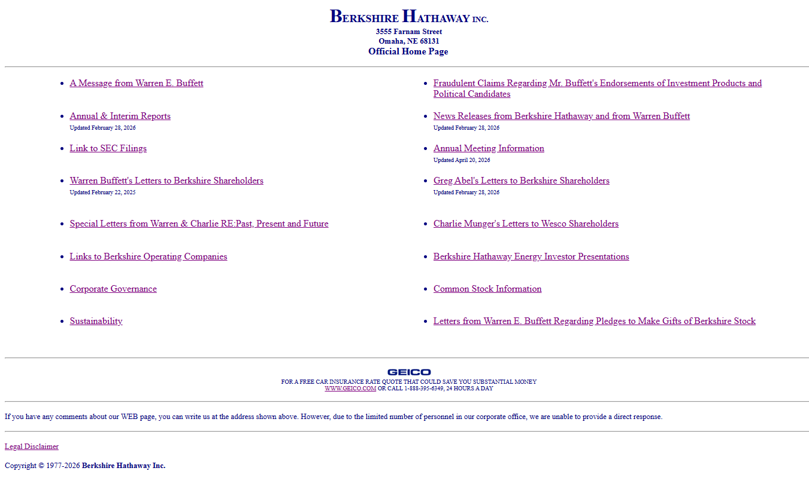

*Nguồn: https://www.berkshirehathaway.com/ — chụp 27/04/2026.*

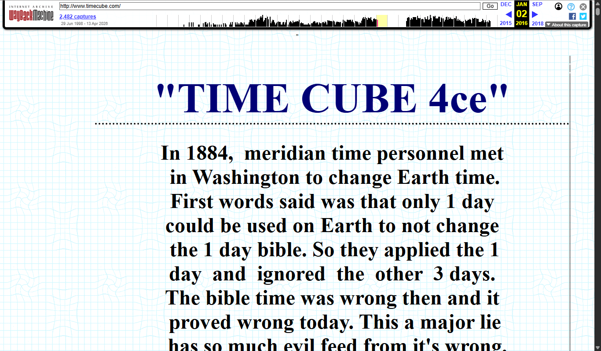

*Nguồn: https://web.archive.org/web/2016/http://www.timecube.com/ — chụp 27/04/2026.*

`berkshirehathaway.com` (tập đoàn của Warren Buffett) duy trì website thuần text HTML từ những năm 1997, gần như không thay đổi: không CSS hiện đại, không responsive, không hierarchy thị giác — y hệt một báo cáo in giấy đặt lên web. `timecube.com` thì đi xa hơn, mô phỏng phong cách "tờ rơi tự xuất bản" với chữ in hoa toàn bộ và cấu trúc giống một poster.

- **Tính hiệu quả:** Trên mobile, layout cố định khoảng 600px buộc người dùng zoom liên tục mới đọc được.
- **Tính hiệu suất:** Thiếu các tính năng web cơ bản như tìm kiếm trong trang, lọc, deep link — người dùng phải đọc tuần tự như báo giấy.
- **Sự hài lòng:** Em nghĩ nội dung của Berkshire Hathaway thực sự có giá trị, nhưng giao diện kiểu này dễ làm thế hệ trẻ nghi ngờ độ tin cậy ngay khi chưa kịp đọc.
- **Liên hệ Norman:** Vi phạm tinh thần *Affordance* và *Mapping* hiện đại — Web cho phép tương tác đa chiều, không chỉ trình bày tuyến tính.

**Khắc phục:** áp dụng responsive design (mobile-first); tận dụng các tính năng web-native (tìm trong trang, deep link, sticky nav, dark mode); tách nội dung khỏi trình bày bằng semantic HTML + CSS; tham khảo các framework hiện đại (Bootstrap, Tailwind) và Material/HIG.

---

## 4. Nhìn lại 12 lỗi qua khung ISO 9241-11

Sau khi đi qua từng lỗi, em thấy 12 lỗi mà Galitz tổng kết về cơ bản đều quy về **vi phạm một hoặc nhiều trong ba đặc tính của tính tiện dùng** mà ISO 9241-11 đặt ra:

- Các lỗi liên quan đến việc **làm thông tin khó tìm hoặc dễ hiểu sai** (lỗi 1, 2, 5, 6, 7, 9) đánh trực tiếp vào **tính hiệu quả**.
- Các lỗi liên quan đến **tốn thời gian, thao tác thừa, đường dẫn dài** (lỗi 6, 7, 8, 9, 12) làm giảm **tính hiệu suất**.
- Các lỗi mang tính **gây khó chịu, mất niềm tin** (lỗi 3, 4, 10, 11) tác động chủ yếu đến **sự hài lòng**.

Tất nhiên, một lỗi có thể đồng thời ảnh hưởng đến cả ba đặc tính — ví dụ "quá tải thông tin" vừa làm người dùng tìm sai (hiệu quả), vừa tốn thời gian (hiệu suất), vừa gây bực bội (hài lòng). Nhưng việc gán mỗi lỗi vào đặc tính bị ảnh hưởng nhiều nhất giúp em nhìn rõ thứ tự ưu tiên khi đi sửa.

Theo cảm nhận cá nhân, nếu em là designer phải sửa một website kém tiện dùng, em sẽ ưu tiên theo thứ tự:

1. **Lỗi 4 và lỗi 9** (auto-play/pop-up và quá tải thông tin) — vì đây là những lỗi khiến người dùng bỏ trang ngay lập tức, sửa ưu tiên cao nhất.
2. **Lỗi 5 và 6** (điều hướng) — vì chúng chặn người dùng hoàn thành nhiệm vụ chính.
3. **Lỗi 1, 2, 3** (hiển thị, đọc) — làm chậm chứ không chặn, có thể sửa song song.
4. **Lỗi 10, 11, 12** (nhất quán, tính thời sự, hiện đại hóa) — ảnh hưởng dài hạn đến uy tín, cần kế hoạch cải tiến đều đặn hơn là sửa gấp.

Cuối cùng, em muốn nhấn mạnh điều cô có nói trong bài giảng: tính tiện dùng không phải thứ "đánh giá một lần là xong". Quy trình hợp lý phải là **Design → Implement → Evaluate → (lặp lại)**, và việc đánh giá cần có người dùng thực, đo bằng các tiêu chí kiểu Tyldesley (1988) như thời gian hoàn thành, tỷ lệ thành công, số lỗi, tần suất dùng help. 12 lỗi của Galitz, theo em, là một checklist rất tốt để chạy ở vòng *Evaluate* — vừa cụ thể, vừa dễ kiểm tra bằng mắt thường mà chưa cần thiết bị đo phức tạp.

---

## 5. Tài liệu tham khảo

1. **Nguyễn Thị Thu Hương** (Khoa CNTT — Bộ môn CNPM, ĐH Thủy Lợi). *Tính tiện dùng của hệ thống tương tác — Bài 3 Phần 2.* Slide bài giảng (file `Bai 3_Phan 2_ Tinh tien dung.pdf`). — **Nguồn chính cho định nghĩa 12 lỗi.**
2. **Galitz, W. O.** (2007). *The Essential Guide to User Interface Design: An Introduction to GUI Design Principles and Techniques* (3rd ed.). Wiley. — Nguồn gốc danh sách 12 lỗi.
3. **Nielsen, J.** (1994). *10 Usability Heuristics for User Interface Design.* Nielsen Norman Group. <https://www.nngroup.com/articles/ten-usability-heuristics/>
4. **Norman, D. A.** (2013). *The Design of Everyday Things* (Revised & Expanded ed.). Basic Books.
5. **ISO/IEC 9241-11:2018.** *Ergonomics of human-system interaction — Part 11: Usability: Definitions and concepts.*
6. **Fogg, B. J.** (2002). *Stanford Guidelines for Web Credibility.* Stanford Persuasive Technology Lab.
7. **Tyldesley, D. A.** (1988). *Employing usability engineering in the development of office products.* The Computer Journal, 31(5).
8. **Web Content Accessibility Guidelines (WCAG) 2.1.** W3C Recommendation. <https://www.w3.org/TR/WCAG21/>
9. **Ceaparu, I., Lazar, J., Bessiere, K., Robinson, J., & Shneiderman, B.** (2004). *Determining causes and severity of end-user frustration.* International Journal of Human–Computer Interaction.
10. **Miller, G. A.** (1956). *The Magical Number Seven, Plus or Minus Two: Some Limits on our Capacity for Processing Information.* Psychological Review, 63(2).
11. **Hick, W. E.** (1952). *On the rate of gain of information.* Quarterly Journal of Experimental Psychology, 4(1).

### Nguồn ảnh minh họa

| # | Lỗi | URL nguồn | Ngày chụp |
|---|---|---|---|
| 1 | Gây nhiễu thị giác | https://web.archive.org/web/2024/https://www.arngren.net/ | 27/04/2026 |
| 2 | Giảm khả năng đọc | https://web.archive.org/web/2022/https://www.suzannecollinsbooks.com/ | 27/04/2026 |
| 3 | Chi tiết khó hiểu | https://www.gilliangoodman.com/lander | 27/04/2026 |
| 4 | Trò gây bực mình | https://web.archive.org/web/2023/https://www.lingscars.com/ | 27/04/2026 |
| 5 | Điều hướng lẫn lộn | https://web.archive.org/web/2024/https://www.arngren.net/ | 27/04/2026 |
| 6 | Điều hướng không hiệu quả | https://www.gatesnfences.com/ | 27/04/2026 |
| 7 | Tổ chức không hiệu quả | https://www.irs.gov/ | 27/04/2026 |
| 8 | Thanh cuộn quá dài | https://www.penny-arcade.com/ | 27/04/2026 |
| 9 | Quá tải thông tin | https://www.craigslist.org/about/sites | 27/04/2026 |
| 10 | Không nhất quán | https://www.art.yale.edu/ | 27/04/2026 |
| 11 | Thông tin cũ/không đề ngày | https://www.spacejam.com/1996/ | 27/04/2026 |
| 12 | Thiết kế lỗi thời | https://www.berkshirehathaway.com/ ; https://web.archive.org/web/2016/http://www.timecube.com/ | 27/04/2026 |

> *Ảnh được chụp tự động bằng công cụ `agent-browser` (v0.26.0) chạy trên Chromium 148, môi trường Windows. Một số website được truy cập qua Wayback Machine khi không phản hồi trực tiếp — phiên bản lưu trữ giữ nguyên thiết kế gốc minh họa cho lỗi.*
