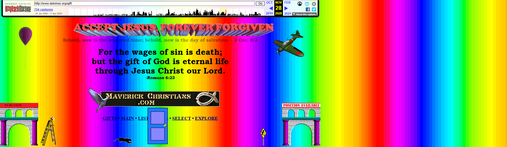
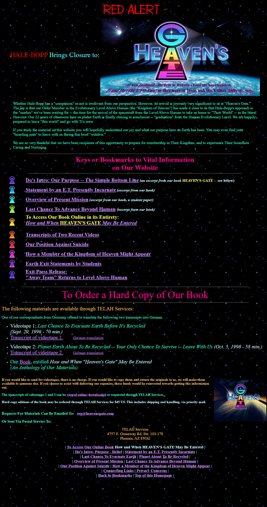
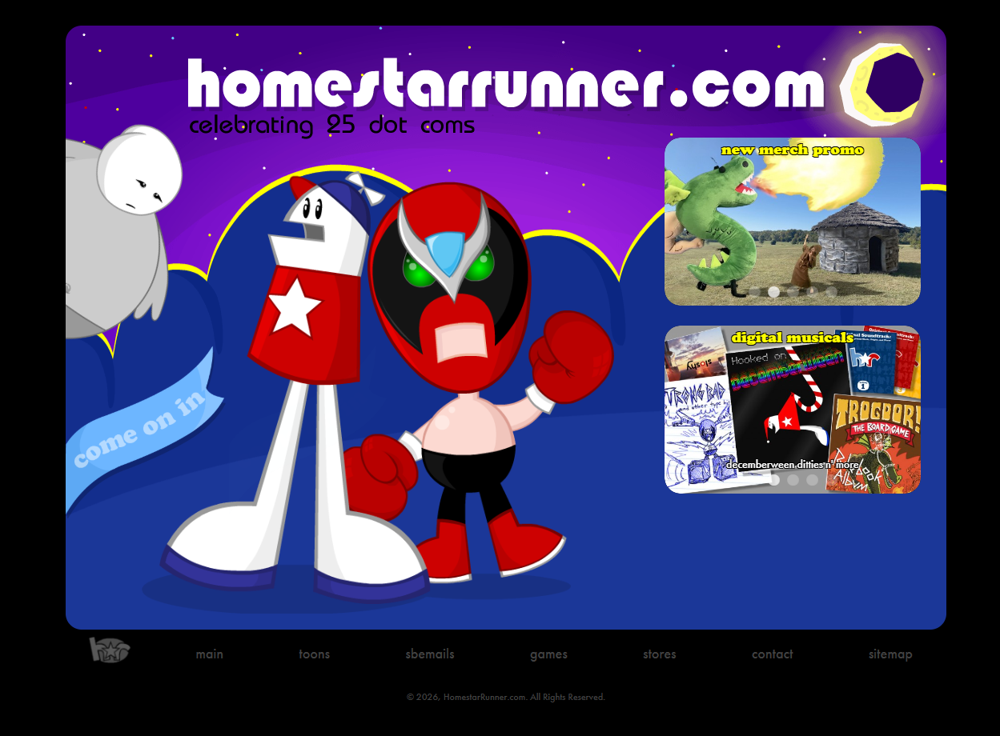

# Bài tập lớn số 1 — Những lỗi trong thiết kế website

> **Môn học:** Tương tác Người – Máy  
> **Chủ đề:** Tính tiện dùng của website  
> **Nguồn lý thuyết chính:** Bài 3 – Phần 2: Tính tiện dùng

---

## 1. Mở đầu

Trong bài học về tính tiện dùng, em hiểu đơn giản rằng một website tốt không chỉ cần đẹp mà còn phải dễ dùng. Người dùng vào trang phải tìm được thông tin mình cần và thao tác không quá rắc rối.

Trong bài này, em chọn 12 lỗi thiết kế website thường gặp theo nội dung đã học. Với mỗi lỗi, em đặt **hình ảnh minh họa ở trên**, sau đó phân tích ngắn gọn theo ba ý:

- **Tính hiệu quả:** lỗi đó làm người dùng khó hoàn thành việc gì.
- **Tính hiệu suất:** lỗi đó làm người dùng mất thêm thời gian hoặc thao tác như thế nào.
- **Khắc phục:** cách sửa để website dễ dùng hơn.

## 2. Cách em chọn ví dụ

Các ví dụ trong bài đều là website có thật. Một số trang vẫn còn truy cập được, một số trang em xem lại qua Wayback Machine vì bản gốc đã cũ hoặc khó truy cập. Ảnh minh họa được lưu trong thư mục `./images/`.

Em cố gắng chọn những website nhìn vào là thấy rõ lỗi, vì như vậy phần phân tích sẽ dễ hiểu hơn và sát với nội dung môn học hơn.

---

## 3. Phân tích 12 lỗi

### **Lỗi 1. Gây nhiễu thị giác**

_Nguồn: https://web.archive.org/web/20201128101902/http://www.dokimos.org/ajff/_

- **Tính hiệu quả:** Trang dùng nền cầu vồng, nhiều màu chữ và nhiều hình trang trí nên người dùng khó biết đâu là nội dung chính. Các liên kết quan trọng như `GIFTS`, `MAIN`, `LIST`, `SELECT`, `EXPLORE` bị lẫn vào các hình ảnh xung quanh.
- **Tính hiệu suất:** Người dùng phải mất thời gian nhìn kỹ và lọc thông tin bằng mắt. Thay vì thấy ngay menu hoặc nội dung cần đọc, họ bị phân tán bởi quá nhiều chi tiết không cần thiết.
- **Khắc phục:** Nên dùng nền đơn giản hơn, giảm số màu nổi bật, bỏ các clipart không liên quan và đặt menu điều hướng ở vị trí rõ ràng.

---

### **Lỗi 2. Làm giảm khả năng đọc thông tin**

_Nguồn: https://web.archive.org/web/2022/https://www.suzannecollinsbooks.com/_

- **Tính hiệu quả:** Nền hoa văn làm chữ phía trên không nổi bật, khiến người dùng khó đọc nội dung về sách. Nếu chỉ đọc lướt, người dùng rất dễ bỏ sót thông tin quan trọng.
- **Tính hiệu suất:** Người dùng phải tập trung nhiều hơn bình thường để tách chữ ra khỏi nền. Việc đọc vì vậy chậm hơn và dễ gây mỏi mắt.
- **Khắc phục:** Nên dùng nền trơn hoặc nền rất nhẹ, tăng độ tương phản giữa chữ và nền, đồng thời hạn chế số font chữ và màu chữ trong cùng một trang.

---

### **Lỗi 3. Nhiều chi tiết khó hiểu**

_Nguồn: https://www.gilliangoodman.com/lander_

- **Tính hiệu quả:** Trang có nhiều chi tiết đồ họa nhưng không làm rõ chỗ nào có thể bấm được. Người dùng có thể không tìm được đường để chuyển sang mục khác hoặc xem thêm thông tin.
- **Tính hiệu suất:** Người dùng phải rê chuột thử nhiều vị trí để đoán đâu là vùng tương tác. Việc này làm mất thời gian và khiến thao tác trở nên không chắc chắn.
- **Khắc phục:** Cần làm rõ nút bấm và liên kết bằng màu sắc, viền, biểu tượng hoặc hiệu ứng hover. Những thao tác quan trọng nên có chữ hướng dẫn ngắn gọn.

---

### **Lỗi 4. Nhiều trò gây bực mình**

- **Tính hiệu quả:** Nền sao chuyển động liên tục làm người dùng khó tập trung vào phần chữ. Nội dung chính bị hiệu ứng nền lấn át.
- **Tính hiệu suất:** Khi đọc, mắt phải liên tục bỏ qua phần nền động nên tốc độ đọc chậm hơn. Người dùng cũng mất thêm công sức để tập trung vào nội dung cần xem.
- **Khắc phục:** Nên hạn chế hiệu ứng chuyển động lặp lại liên tục, cho phép người dùng tắt hiệu ứng và không tự động phát âm thanh hoặc mở pop-up khi chưa có thao tác của người dùng.

---

### **Lỗi 5. Sự điều hướng lẫn lộn**

_Nguồn: https://web.archive.org/web/20240125205529/http://www.mrbottles.com/_

- **Tính hiệu quả:** Các liên kết nằm rải rác ở nhiều vị trí khác nhau nên người dùng khó nhận ra đâu là menu chính và đâu là liên kết phụ. Khi vào trang con, người dùng cũng khó biết mình đang ở mục nào.
- **Tính hiệu suất:** Người dùng phải dùng nút Back hoặc tự dò lại đường đi nếu muốn quay về phần trước. Việc tìm thông tin vì vậy mất nhiều thao tác hơn.
- **Khắc phục:** Nên tạo thanh menu chính thống nhất, thêm breadcrumb, đánh dấu mục đang xem và nhóm các liên kết theo chủ đề rõ ràng.

---

### **Lỗi 6. Điều hướng không hiệu quả**

_Nguồn: https://homestarrunner.com/_

- **Tính hiệu quả:** Trang dùng hình nhân vật làm liên kết nên người mới vào khó biết mỗi hình dẫn tới mục nào. Nếu người dùng muốn tìm một nội dung cụ thể, họ không có đường đi rõ ràng ngay từ đầu.
- **Tính hiệu suất:** Người dùng phải rê chuột vào từng nhân vật để xem tên mục, sau đó còn phải đi qua nhiều trang danh sách trung gian. Thao tác tìm nội dung bị kéo dài không cần thiết.
- **Khắc phục:** Nên thêm menu chữ rõ ràng bên cạnh hình minh họa, giảm số trang trung gian, thêm thanh tìm kiếm và sắp xếp nội dung theo danh mục dễ hiểu.

---

### **Lỗi 7. Tổ chức hoạt động không hiệu quả**

_Nguồn: https://www.irs.gov/_

- **Tính hiệu quả:** Thông tin trên trang bị chia thành nhiều phần ở nhiều trang khác nhau. Người dùng có thể bỏ sót bước hoặc không hiểu đầy đủ một quy trình cần làm.
- **Tính hiệu suất:** Người dùng phải mở nhiều tab và tự ghép các phần thông tin lại với nhau. Một việc đáng lẽ có thể xem trong một hướng dẫn hoàn chỉnh lại mất nhiều thời gian hơn.
- **Khắc phục:** Nên tổ chức nội dung theo nhiệm vụ của người dùng, tạo các bài hướng dẫn đầy đủ theo từng quy trình, giảm số trang phải mở và đặt các bước quan trọng ở cùng một nơi.

---

### **Lỗi 8. Thanh cuộn quá dài và không hiệu quả**

_Nguồn: https://www.penny-arcade.com/_

- **Tính hiệu quả:** Trang có quá nhiều nội dung xếp dài từ trên xuống dưới nên một số phần quan trọng có thể bị bỏ qua. Người dùng cũng khó biết mình đang ở vị trí nào trong trang.
- **Tính hiệu suất:** Khi cuộn xuống sâu, nếu muốn quay lại menu ở đầu trang thì người dùng phải kéo lên rất lâu. Trên điện thoại, thao tác này còn mất thời gian hơn.
- **Khắc phục:** Nên thêm nút quay lại đầu trang, dùng thanh menu cố định khi cuộn, chia nội dung thành các nhóm rõ ràng hoặc dùng phân trang/lazy-load khi cần.

---

### **Lỗi 9. Quá tải thông tin**

_Nguồn: https://www.craigslist.org/about/sites_

- **Tính hiệu quả:** Trang hiển thị quá nhiều liên kết dạng chữ nhỏ và khá giống nhau. Khi tìm một địa điểm cụ thể, người dùng dễ bỏ sót hoặc phải dùng Ctrl+F.
- **Tính hiệu suất:** Người dùng phải quét qua một danh sách rất dài thay vì chọn trong các nhóm đã được chia sẵn. Việc tìm kiếm vì vậy mất nhiều thời gian hơn.
- **Khắc phục:** Nên chia danh sách theo châu lục, quốc gia, thành phố; thêm ô tìm kiếm; chỉ hiện nội dung chi tiết sau khi người dùng chọn nhóm cần xem.

---

### **Lỗi 10. Sự không nhất quán trong thiết kế**

_Nguồn: https://www.art.yale.edu/_

- **Tính hiệu quả:** Mỗi phần của website có thể dùng màu nền, kiểu chữ và bố cục khác nhau nên người dùng khó đoán cách sử dụng. Các thông tin quan trọng như tuyển sinh, liên hệ hoặc chương trình học có thể khó tìm hơn.
- **Tính hiệu suất:** Khi sang trang khác, người dùng phải làm quen lại với cách trình bày mới. Cách thao tác đã học ở trang trước không chắc áp dụng được cho trang sau.
- **Khắc phục:** Nên giữ một hệ thống thiết kế chung cho menu, nút, font chữ và bố cục chính. Website vẫn có thể sáng tạo ở phần hình ảnh nhưng không nên làm mất khả năng sử dụng.

---

### **Lỗi 11. Thông tin quá cũ hoặc không đề ngày tháng**

_Nguồn: https://www.spacejam.com/1996/_

- **Tính hiệu quả:** Trang không thể hiện rõ thông tin còn được cập nhật hay không. Người dùng có thể hiểu nhầm rằng nội dung trên trang vẫn còn mới hoặc còn chính xác ở hiện tại.
- **Tính hiệu suất:** Người dùng phải tự kiểm tra thêm ở nguồn khác để biết thông tin còn đúng không. Việc xác minh này làm mất thêm thời gian.
- **Khắc phục:** Nên ghi rõ ngày đăng và ngày cập nhật cuối. Nếu là trang lưu trữ, nên có thông báo như “Nội dung cũ/không còn cập nhật”.

---

### **Lỗi 12. Thiết kế lỗi thời do mô phỏng tài liệu in và hệ thống cũ**

_Nguồn: https://www.berkshirehathaway.com/_

_Nguồn: https://web.archive.org/web/2016/http://www.timecube.com/_

- **Tính hiệu quả:** Website trình bày giống danh sách tài liệu hoặc tờ rơi cũ nên người dùng khó tìm nhanh phần cần xem. Trang cũng thiếu các phần hỗ trợ như menu rõ ràng, phân nhóm nội dung hoặc tìm kiếm.
- **Tính hiệu suất:** Trên màn hình nhỏ, người dùng có thể phải phóng to, thu nhỏ hoặc kéo ngang để đọc. Việc tìm thông tin chủ yếu phải làm thủ công nên mất thời gian hơn.
- **Khắc phục:** Nên thiết kế lại theo hướng responsive, chia nội dung thành các nhóm rõ ràng, dùng HTML/CSS hiện đại và thêm các chức năng cơ bản như tìm kiếm, menu cố định hoặc liên kết nhanh.

---

## 4. Nhận xét chung

Sau khi phân tích 12 lỗi, em thấy các lỗi này tuy khác nhau nhưng đều làm website khó dùng hơn. Có lỗi làm người dùng không đọc được nội dung, có lỗi làm họ không biết bấm vào đâu, có lỗi lại khiến họ mất thời gian vì phải đi qua quá nhiều bước.

Nếu liên hệ với hai phần đã phân tích trong bài, em có thể tóm tắt như sau:

- Các lỗi như nhiễu thị giác, chữ khó đọc, điều hướng lẫn lộn và quá tải thông tin làm giảm **tính hiệu quả**.
- Các lỗi như điều hướng không hiệu quả, tổ chức nội dung kém và trang quá dài làm giảm **tính hiệu suất**.

Theo em, khi thiết kế website nên đặt người dùng ở vị trí trung tâm. Người thiết kế không nên chỉ nghĩ trang trông “ấn tượng” hay “đầy đủ thông tin”, mà cần xem người dùng có tìm được thông tin nhanh không và có hiểu cách dùng không.

Trong các lỗi trên, em nghĩ cần ưu tiên sửa trước những lỗi làm người dùng khó đọc, khó tìm thông tin hoặc phải thao tác quá nhiều. Sau đó mới đến các lỗi dài hạn hơn như cập nhật thông tin, thống nhất giao diện và hiện đại hóa thiết kế.

---

## 5. Kết luận

Qua bài này, em nhận ra tính tiện dùng là một phần rất quan trọng trong thiết kế website. Một trang web có thể có nội dung tốt, nhưng nếu trình bày rối, khó đọc hoặc khó điều hướng thì người dùng vẫn có thể rời đi.

12 lỗi trong bài giống như một danh sách kiểm tra cơ bản khi đánh giá website. Khi nhìn vào một trang, ta có thể tự hỏi: nội dung có dễ đọc không, menu có rõ không, người dùng có bị bắt thao tác quá nhiều không, thông tin có đáng tin không. Nếu trả lời được các câu hỏi đó thì việc cải thiện website sẽ thực tế hơn.

Theo em, thiết kế website tốt không nhất thiết phải phức tạp. Quan trọng nhất là rõ ràng, dễ hiểu, dễ thao tác và tôn trọng thời gian của người dùng.

---

## 6. Tài liệu tham khảo

1. Nguyễn Thị Thu Hương. _Tính tiện dùng của hệ thống tương tác — Bài 3 Phần 2._ Slide bài giảng.
2. Galitz, W. O. (2007). _The Essential Guide to User Interface Design._ Wiley.
3. ISO/IEC 9241-11:2018. _Usability: Definitions and concepts._
4. Web Content Accessibility Guidelines (WCAG) 2.1. <https://www.w3.org/TR/WCAG21/>

### Nguồn ảnh minh họa

| #   | Lỗi                        | URL nguồn                                                                                      | Ngày chụp  |
| --- | -------------------------- | ---------------------------------------------------------------------------------------------- | ---------- |
| 1   | Gây nhiễu thị giác         | https://web.archive.org/web/20201128101902/http://www.dokimos.org/ajff/                        | 27/04/2026 |
| 2   | Giảm khả năng đọc          | https://web.archive.org/web/2022/https://www.suzannecollinsbooks.com/                          | 27/04/2026 |
| 3   | Chi tiết khó hiểu          | https://www.gilliangoodman.com/lander                                                          | 27/04/2026 |
| 4   | Trò gây bực mình           | https://www.heavensgate.com/                                                                   | 27/04/2026 |
| 5   | Điều hướng lẫn lộn         | https://web.archive.org/web/20240125205529/http://www.mrbottles.com/                           | 27/04/2026 |
| 6   | Điều hướng không hiệu quả  | https://homestarrunner.com/                                                                    | 27/04/2026 |
| 7   | Tổ chức không hiệu quả     | https://www.irs.gov/                                                                           | 27/04/2026 |
| 8   | Thanh cuộn quá dài         | https://www.penny-arcade.com/                                                                  | 27/04/2026 |
| 9   | Quá tải thông tin          | https://www.craigslist.org/about/sites                                                         | 27/04/2026 |
| 10  | Không nhất quán            | https://www.art.yale.edu/                                                                      | 27/04/2026 |
| 11  | Thông tin cũ/không đề ngày | https://www.spacejam.com/1996/                                                                 | 27/04/2026 |
| 12  | Thiết kế lỗi thời          | https://www.berkshirehathaway.com/ ; https://web.archive.org/web/2016/http://www.timecube.com/ | 27/04/2026 |
